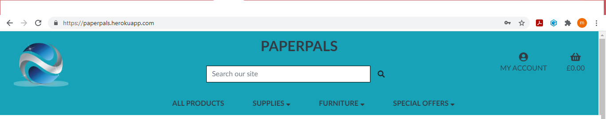
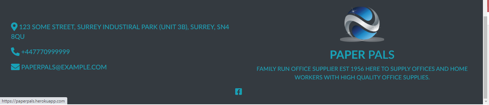
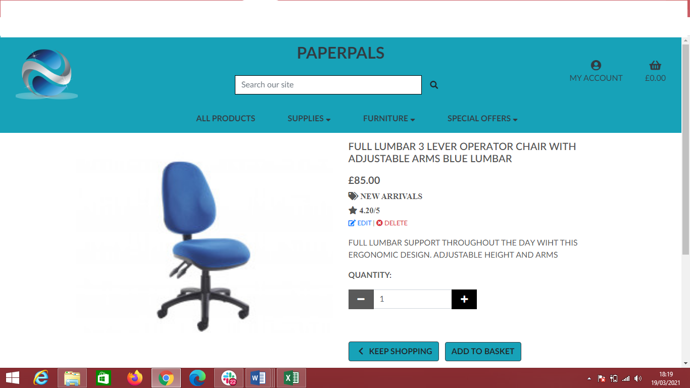
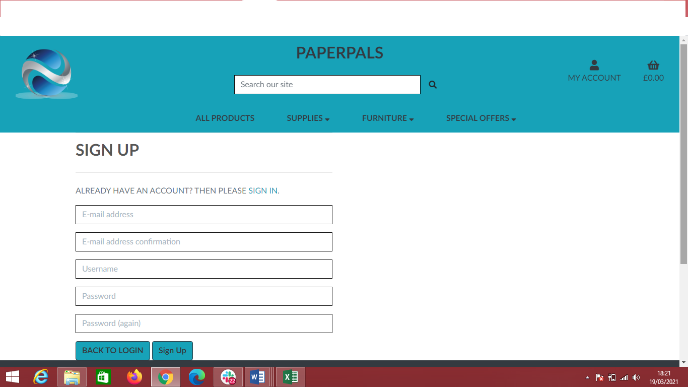
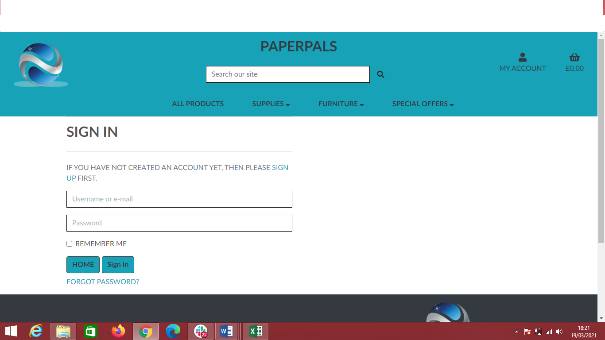
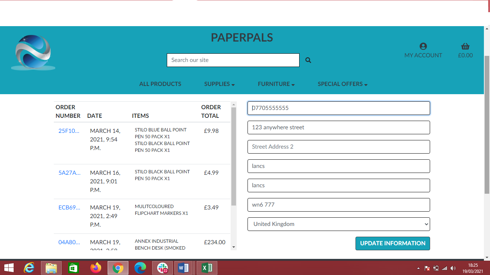
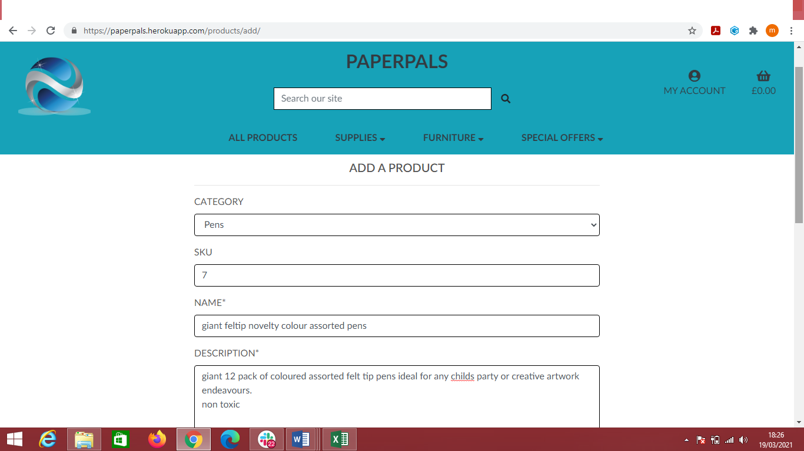
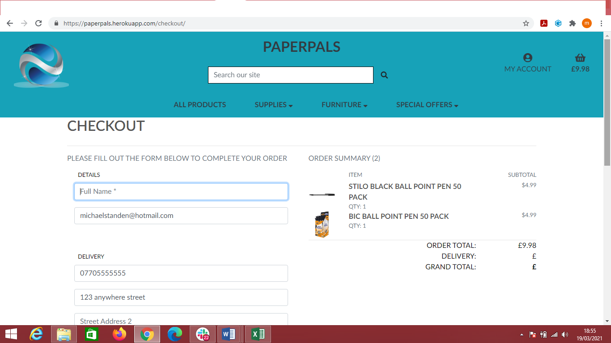

# Paper Pals
## [Live Heroku App Link](https://paperpals.herokuapp.com/)
## [GitHub repository Link](https://michaelstanden.github.io/ms4_ecommerce/)
#### PaperPals e-commerce store was designed, built and deployed by Michael Standen as his final project for the Code Institute Full Stack Web Development diploma. The purpose of PaperPals online shop is to resemble shops and online stores you would see for office supplies and be a good competitor if it was used as a client based website for their brief. This website uses intuitive, smooth and effortless online shopping experiences through the use of streamline clicks, navigation and gives the user full shopping experience with functions such as a secure checkout and a search bar that can search for products, descriptions of products and also categories.
## Table of Contents
### 1. [UX](#ux)
### 2. [Features](#features)
### 3. [Information Architecture](#information-architecture)
### 4. [Technologies Used](#technologies-used)
### 5. [Testing](#testing)
### 6. [Deployment](#deployment)
### 7. [Credits](#credits)

## UX
### Goals
#### Visitor Goals
The central target audience for PaperPals are:
+ People who manage an office, are a home worker or a civilian wanting to buy pens and paper supplies for everyday use.
+ People who expect a secure and streamline online shopping service.
+ People searching for quality products from pens, paper, inks, office furniture and so on.
User Goals are:
+ Find and buy quickly office supplies the user is needing.
+ Enjoy browsing through our deals and new arrivals and list of products.
+ Be able to navigate through and to the shop easily, find what they need and make a safe and secure purchase.
+ Buy from a trustworthy online shop.
#### Business Goals
The Goals of Paperpals business are:
+ Provide a professional online shop that helps the user to feel safe that they are buying from a trustworthy source.
+ Connect to other buyers of the shop through social media channels. To check our credibility.
+ Make sales of products easy for users so they will use the service again, encouraging repeat custom.
### User Stories
### As a Shopper
1. As a shopper I want to view list of products.
2. As a shopper I want to view product details so that I can identify price, description, product rating and product image.
3. As a shopper I want to easily view total of my purchases at any time.
4. As a shopper I want to sort the list of available products by best rated, price and categorically.
5. As a shopper I want to search for a product by name or description.
6. As a shopper I want to view items in my bag to be purchased.
7. As a shopper I want to adjust the quantity of individual items in my bag.
8. As a shopper I want to easily enter my payment information.
9. As a shopper I want to feel my personal and payment information is safe and secure.
10. As a shopper I want to view an order confirmation after checkout.
11. As a shopper I want to receive email confirmation after checking out.
### As a Site User
1. As a user I want to easily register for an account.
2. As a user I want to easily log in or out.
3. As a user I want to easily recover my password in case I forget it.
4. As a user I want to receive email confirmation after registering.
5. As a user I want to have a personalised user profile.
### As a Shop Owner
1. As an owner I want to add a product.
2. As an owner I want to edit a product.
3. As an owner I want to delete a product.

## Design Choices
### Font
+ Primary font ‘Shippori Mincho B1’ was chosen for the main text of the site due to its clear readability and the style is common in books stores and other office related store. This font gives a professional and sleek look to the site.
+ The secondary font 'Arial’ again for readability and to keep the site elegant and simple.
### Icons
+ In order to keep the site uncluttered only a few icons were utilized.
+ The search icon, shopping basket and user icons were used in the navigation bar as they are conventionally used in this setting and would be what the user expects to see.
+ The Facebook logo icon is included in the footer to lead visitors to facebook page.
+ Tag icon was used for Category, star as a product rating, and some basic edit and delete icons.
+ Basic plus and minus icons were used for quantity.
### Colours
+ Bootstrap info button Blue:
+ White: #ffffff
+ Dark Grey: #343A40
+ Black: #000000
+ Above colour palette was chosen based on research from various office supply sites and also colours associated with buying and tranquillity. I wanted the user be calm and confident when shopping. The colour palettes of blue and white offer this as psychological research shows. I was going to go with yellow as this is a popular colour used in psychology and marketing to draw attention. However I felt it didn’t fit the theme. Blue has been shown to inspire confidence in decision making in consumers, as well as giving a calm and collected feeling when looking at the colour. These are qualities I want users to have when visiting the site, and remember when buying products from this store.
### Styling
+ Curved corners were applied on Buttons and Product cards.
+ Text shadow and brightness were applied on Category cards on Home Page to make text easier to read, however only 10% reduction as I still wanted the images to pop. 
### Wireframes
#### These wireframes were created using [Balsamiq](https://balsamiq.com/) during the Scope Plane part of the design and planning process for this project.
+ [Home](media/wireframes/homepage_desktop_wf.png)
+ [Home mobile](media/wireframes/homepage_mobile.png)
+ [Products](media/wireframes/product_desktop_wf.png)
+ [Products Mobile](media/wireframes/product_mobile_wf.png)
+ [Product Details](media/wireframes/product_details_wf.png)
+ [Product Details Mobile](media/wireframes/product_description_mobile.png)
+ [Shopping Basket](media/wireframes/basket_desktop_wf.png)
+ [Shopping Basket Mobile](media/wireframes/basket_mobile.png)
+ [Checkout](media/wireframes/checkout_desktop_wf.png)
+ [Checkout Mobile](media/wireframes/checkout_mobile.png)
## Features
### Existing Features
#### Elements on every page
##### Navbar:

+ The navbar features on every page
+ The navigation bar features PaperPals logo on the far left, and site name PaperPals in the middle of the page which both links to the home page of the site. This is common practice I found in layouts with other sites. Which I felt was important in giving user familiarity when shopping.
+ In desktop view on the centre of the navbar is a list of the product pages: All Products, Supplies, Furniture and Special Offers. All of the links apart of All Products are a dropdown menu which lists out the categories of shop products.
+ Beside navigation links, on desktop view a search bar is located just on the top of navigation links, search logic includes both product name and description.
+ On the right side of the navbar are the links to shopping basket and dropdown on user icon.
+ A user who is currently logged out will also see options to register or log into the website.
+ A user who is logged in will see options to view their account page or log out.
+ Superuser or Admin will have additional option Product Management where new product can be added.
+ The shopping basket icon is located to the far right of the navigation bar. Once a user has added at least one item to their basket a bold font will be applied to basket and amount for specific product or products.

+ In tablet and mobile view the logo and site name PaperPals are hidden, and Home link is added to burger menu. This is to aid cleanliness and declutter the navbar.
+ The shopping basket icon is displayed at the right of the navigation bar, and the burger icon to display the full navigation menu is on the far left, with search bar and user icon in the middle of navigation bar because that is where a user would expect to find it.
##### Footer

+ The footer features on every page.
+ The footer background of dark grey and blue text was chosen to maintain same colour palette. I chose dark grey as this was a significant colour change to suggest this is separate and the footer of the page.
+ Location shown in footer is linked to Google Maps, email can be sent using default mail provider and telephone is just for information.
+ The footer also includes a link to Facebook. If PaperPals ever launches as a viable site then this would link to their specific Facebook page to show customer ratings, news and updates.
#### Home Page
##### Hero slider/carousel
+ The home page hero slider/carousel features 3 slides of images from. All of them were selected randomly from online source. User testimonials are added at the bottom of carousel.
+ Below carousel some of the PaperPals product links are shown in image forms as links so users can see a visual appealing site and have image reference of where to click for ease.
##### Shop image links 
+ Below the PaperPals characteristics are a selection of the shop categories, displayed with beautiful product photographs and clear headings. The user can click any of these images to be taken to the relevant sections of the shop. On hover there is some light zoom in action.
+ On desktop view these sections are displayed with 3 categories in one line as shown on image. On smaller screens each category is made as col-12.
#### Products Page
##### Category buttons
+ The main products page features an inline list of buttons leading to each section of the shop, on click of the button, selected category will retrieve and direct to the active class. These buttons are not visible on mobile view to save space, instead a dropdown button, with all categories included and selected category will be selected as active and shown as dropdown text.
##### Sort
+ Just under category buttons on left side, number of products we currently have are displayed. (73)
+ Just under category buttons on right side, sort selector is placed and includes the option to sort its results by "Price (low to high)", "Price (high to low)","Rating (low to high)" and "Rating (high to low)". This is available on every page and for every category of product.
##### Products selection
+ Products in the shop are displayed as cards with images, their title, price, category and rating displayed underneath each image. If user is logged in as superuser Edit and Delete functions are appearing underneath rating.
+ Each product in the list has a link to it's respective product listing with more information.
#### Products Details Page

##### Product Image
+ On medium sized screen, up to large and extra-large image is displayed on left side on the screen.
+ On mobile phone screens image is displayed first in the centre above product details.
##### Product details
+ The product title, price, category, rating, edit-delete functions (if user is logged as superuser) and description are all clearly visible on the product listing page.
+ A quantity selector allows the user to select the quantity of a product they wish to purchase. Customers cannot go above 99 or below 0.
+ "Keep shopping" and "Add to basket" buttons are displayed right under the quantity selection.
##### Notification messages
+ Notification messages are based on django message levels, for this specific project four levels were used: INFO, SUCCESS, WARNING and ERROR.
+ When a user adds an item to their basket, then Bootstrap toast success message appears with a green toast capper to inform them that their item has been successfully added and shows the user minified version of their basket, with information such as what user has acted upon e.g. Added ** product to your basket, basket summary, quantity and total price. They are then given the option to secure checkout in toast or they can just close it and continue their shopping.
+ Error message will appear with a red toast capper if any error occur on website, for example if empty search string is searched, toast error will appear with short details.
+ Toast for Info and Warning were created also and are similar to the error message, only one thing that is different is toast capper colour, for info is light blue and for warning is orange. This was to keep consistency of design throughout the site and is what users expect when shopping online.
#### Register Page

+ A user who is not logged in can create a new account using the sign up page. The page on this form includes a username (which must be unique), email address, email address confirmation, password and password conformation fields.
#### Login Page

+ The login page features a standard login form asking for username and password with option to remember user.
+ In case user forgot password, they can retrieve it by clicking on Forgot Password? link, user should provide email, if email exists, recovery steps will be sent to users email address provided.
#### Profile Page

+ The profile page is split in two sections:
    + Order Summary where user can see summary of all their previous orders.
    + Profile Info where user can update their phone number, street address, city, county, postal code and country.
#### Sign Out Page
+ Prompting user are they sure they want to log out? If they click on log out.
+ ‘Cancel’ button is there to cancel action and returns user to home page, second button ‘sign out’ is to confirm log out action and then returns user again to home page.
#### Product Managment Page
##### Add Product

+ Only admin or superuser can add product, once admin is logged in, Product Management option is available under user icon.
+ Admin then can add product, only name, description and price are required fields.
+ Once the product is added page is redirected to that specific product.
##### Edit Product
+ Only admin or superuser can edit product.
+ Admin can edit product, only name, description and price are required fields.
+ On the bottom small image of the product is shown so the Admin can see which one is uploaded.
#### Basket Page
##### Desktop

+ The shopping basket page features a summary of all the items the user has added to their basket.
+ On desktop view, image comes first, product name, size, sku, price, quantity and subtotal then follows.
+ With plus and minus symbols to adjust quantity.
+ Update link which updates adjusted quantity.
+ Remove link deletes product from basket.
+ On the bottom of basket/page user can see basket total amount.
+ Keep Shopping button redirects user back to all products and secure checkout brings user to checkout page.
##### Mobile
+ Due to basket content being in table format, scroll left-right appeared once testing on mobile.
+ To fix this and prevent this from being a blip on some occurrences, content was spread in separate html files and included in basket.html.
+ Image, followed by product details comes first to show users what products they have in basket, then Basket total, followed by keep shopping and add to basket buttons.
+ Edit link updates adjusted quantity.
+ Remove link deletes product from basket.
#### Checkout Page

+ Checkout is divided in three sections:
 + Order summary showing everything is pending payment.
 + Personal details such as email address and Full Name, and delivery details with option to save delivery information to users profile.
 + On the bottom there is input field for card payment validated by Stripe
+ Two buttons are also included, one is to Adjust basket which brings user back to basket and second one is complete order to process payment.
+ Under buttons small red text is placed, notifying user how much credit card will be charged.
+ Once Complete Order is clicked form validation is done first, if everything is correct, an overlay with a loading spinner shows up while payment is processing.
#### Checkout Success Page
+ Displayed is very simple order confirmation with order details, product ordered details, delivery and personal details and order total amount.
+ At the bottom button saying click me to see out latest deals, is shown, on click user is directed to deals category products.
#### Django Email
+ In order to register on site, user needs to provide email address, in case user forgets password, by clicking on Forgot Password?(on Sign Up page) link and providing email address, user can receive next step in password recovery.
+ Also once users checks out, order confirmation is sent to user with all details.
+ For this all to work, gmail account was used and set it up with Django.
### Features to Implement
+ Discount codes.
    + Checkout page to include a field for customers to enter discount codes or coupons to adjust their final payment cost.
+ Newsletter.
    + Users would receive an email with current deals, and depending on situation coupons or discount codes would be included.
+ Additional payment methods.
    + Implement Paypal.
+ Further function on search bar such as prices or logic to handle more complex queries.
    + Online live tracker to see where your order is and when it’s been dispatched.
+ Broadening products and categories.
## Information Architecture
### Database Choice
+ As a framework Django works with SQL databases. During development on my local machine I worked with the standard sqlite3 database installed with Django.
+ On deployment, the SQL database provided by Heroku is a PostgreSQL database.
### Data Models
#### User
+ The User model utilized for this project is the standard one provided by django.contrib.auth.models
#### Product app models
##### Category
Within the products app, the Category model holds all the data needed for the categories in the shop.
Name | Key in DB | Validation | Field Type
------------ | ------------- | ------------- | -------------
Name | name | max_length=254 | CharField
Friendly Name | friendly_name | max_length=254, null=True, blank=True | CharField 

##### Product
Within the products app, the Product model holds all the data needed for the products in the shop.

Name | Key in DB | Validation | Field Type
------------ | ------------- | ------------- | -------------
Category | category | 'Category', null=True, blank=True, on_delete=models.SET_NULL | ForeignKey
SKU | sku | max_length=254, null=True, blank=True | CharField
Name | name | max_length=254 | CharField
Description | description |  | TextField
Price | price | max_digits=6, decimal_places=2 | DecimalField
Rating | rating | max_digits=6, decimal_places=2, null=True, blank=True | DecimalField
Image URL | image_url | max_length=1024, null=True, blank=True | URLField
Image | image | null=True, blank=True | ImageField
#### Checkout app models
Within the checkout app, the Order and OrderLineItem models hold the data needed for users to create and pay for their orders.
##### Order
Name | Key in DB | Validation | Field Type
------------ | ------------- | ------------- | -------------
Order Number | order_number | max_length=32, null=False, editable=False | CharField
User Profile | user_profile | UserProfile, on_delete=models.SET_NULL, null=True, blank=True, related_name='orders' | ForeignKey
Full Name | full_name | max_length=50, null=False, blank=False | CharField
Email | email | max_length=254, null=False, blank=False | EmailField
Phone Number | phone_number | max_length=20, null=False, blank=False | CharField
Country | country | blank_label='Country *', null=False, blank=False | CountryField
Postcode | postcode | max_length=20, null=True, blank=True | CharField
City | city | max_length=40, null=False, blank=False | CharField
Street Address 1 | street_address1 | max_length=80, null=False, blank=False | CharField
Street Address 2 | street_address2 | max_length=80, null=True, blank=True | CharField
County | county | max_length=80, null=True, blank=True | CharField
Date | date | auto_now_add=True | DateTimeField
Order Total | order_total | max_digits=10, decimal_places=2, null=False, default=0 | DecimalField
Original Basket | original_basket | null=False, blank=False, default='' | TextField
Stripe PID | stripe_pid | max_length=254, null=False, blank=False, default='' | CharField
##### OrderLineItem
Name | Key in DB | Validation | Field Type
------------ | ------------- | ------------- | -------------
Order | order | Order, null=False, blank=False, on_delete=models.CASCADE, related_name='lineitems' | ForeignKey
Product | product | Product, null=False, blank=False, on_delete=models.CASCADE | ForeignKey
Quantity | quantity | null=False, blank=False, default=0 | IntegerField
Line Item Total | lineitem_total | max_digits=6, decimal_places=2, null=False, blank=False, editable=False | DecimalField
#### Profiles app models
Within the Profiles app, UserProfile model hold the data needed for users to so it can be displayed as users information.
##### UserProfile
Name | Key in DB | Validation | Field Type
------------ | ------------- | ------------- | -------------
User | user | User, on_delete=models.CASCADE | OneToOneField
Default Phone Number | default_phone_number | max_length=20, null=True, blank=True | CharField
Default Street Address 1 | default_street_address1 | max_length=80, null=True, blank=True | CharField
Default Street Address 2 | default_street_address2 | max_length=80, null=True, blank=True | CharField
Default City | default_city | max_length=40, null=True, blank=True | CharField
Default County | default_county | max_length=80, null=True, blank=True | CharField
Default Postcode | default_postcode | max_length=20, null=True, blank=True | CharField
Default Country | default_country | blank_label='Country', null=True, blank=True | CountryField
## Technologies Used
#### Tools
+ [Gitpod](https://www.gitpod.io/) as online IDE used for developing this project.
+ [Django](https://www.djangoproject.com/) as python web framework for rapid development and clean design.
+ [Stripe](https://stripe.com/en-ie) as payment platform to validate and accept credit card payments securely.
+ [AWS S3 Bucket](https://aws.amazon.com/) to store images entered into the database.
+ [Boto3](https://boto3.amazonaws.com/v1/documentation/api/latest/index.html) to enable creation, configuration and management of AWS S3.
+ [Django Crispy Forms](https://django-crispy-forms.readthedocs.io/en/latest/) to style django forms.
+ [Django Storages](https://django-storages.readthedocs.io/en/latest/) a collection of custom storage backends with django to work with boto3 and AWS S3.
+ [Django Allauth](https://django-allauth.readthedocs.io/en/latest/) to handle register, log in, log out, password recovery actions.
+ [Django Countries](https://pypi.org/project/django-countries/2.0/) to handle country selection.
+ [Gunicorn](https://pypi.org/project/gunicorn/) WSGI HTTP Server for UNIX to aid in deployment of the Django project to heroku.
+ [Pillow](https://pillow.readthedocs.io/en/stable/) as python imaging library to aid in processing image files to store in database.
+ [Psycopg2](https://pypi.org/project/psycopg2/) as PostgreSQL database adapter for Python.
+ [PIP3](https://pip.pypa.io/en/stable/) for installation of tools needed in this project.
+ [Git](https://git-scm.com/) to handle version control.
+ [GitHub](https://github.com/) to store and share all project code remotely.
+ [Balsamiq](https://balsamiq.com/) to create the wireframes for this project.
#### Databases
+ [PostgreSQL](https://www.postgresql.org/) for production database, provided by heroku.
+ [SQlite3](https://www.sqlite.org/index.html) for development database, provided by django.
#### Libraries
+ [JQuery](https://jquery.com/) to simplify DOM manipulation.
+ [Bootstrap](https://getbootstrap.com/) to simplify the structure of the website and make the website responsive easily.
+ [FontAwesome](https://fontawesome.com/) to provide icons for PaperPals webshop.
+ [Google Fonts](https://fonts.google.com/) to style the website fonts.
#### Languages
+ This project uses HTML, CSS, JavaScript and Python programming languages.
## Testing
Testing information can be found in separate [TESTING.md](testing.md) file.
## Deployment
### Run this project locally
To run this project on your own IDE follow the instructions below:
+ Ensure you have the following tools: - An IDE such as [Visual Studio Code](https://code.visualstudio.com/)
+ The following must be installed on your machine: - [PIP](https://pip.pypa.io/en/stable/installing/) - [Python 3](https://www.python.org/downloads/) - [Git](https://gist.github.com/derhuerst/1b15ff4652a867391f03) 
+ To allow you to access all functionality on the site locally, ensure you have created free accounts with the following services: - [Stripe](https://stripe.com/en-ie) - [AWS](https://aws.amazon.com/) and [set up an S3 bucket](https://docs.aws.amazon.com/AmazonS3/latest/gsg/CreatingABucket.html)
+ Please click the links above for documentation on how to set these up and retrieve the necessary environment variables.
#### Instructions
1. Save a copy of the github repository located at https://michaelstanden.github.io/ms4_ecommerce/ by clicking the "download zip" button at the top of the page and extracting the zip file to your chosen folder. If you have Git installed on your system, you can clone the repository with the following command.
```
git clone https://michaelstanden.github.io/ms4_ecommerce/
```
2. Open your preferred IDE, open a terminal session in the unzip folder or cd to the correct location.
3. A virtual environment is recommended for the Python interpreter, I recommend using Pythons built in virtual environment. Enter the command:
```
python -m .venv venv
```
*NOTE: The python part of this command and the ones in other steps below assumes you are working with a windows operating system. Your Python command may differ, such as python3 or py*.

4. Activate the .venv with the command:
```
.venv\Scripts\activate
```
*Again this command may differ depending on your operating system, please check the [Python Documentation on virtual environments](https://docs.python.org/3/library/venv.html) for further instructions.*
5. If needed, Upgrade pip locally with:
```
pip install --upgrade pip
```
6. Install all required modules with the command:
```
pip -r requirements.txt
```
7. Set up the following environment variables within your IDE.
+ If using VSCode, locate the settings.json file within the .vscode directory and add your environment variables as below. Do not forget to restart your machine to activate your environment variables or your code will not be able to see them:
```
 "terminal.integrated.env.windows": {
    "HOSTNAME": "<enter hostname here>",
    "AWS_ACCESS_KEY_ID": "<enter key here>",
    "AWS_SECRET_ACCESS_KEY": "<enter key here>",
    "DATABASE_URL": "<enter key here>",
    "EMAIL_HOST_PASS": "<enter key here>",
    "EMAIL_HOST_USER": "<enter url here>",
    "SECRET_KEY": "<enter url here>",
    "STRIPE_PUBLIC_KEY": "<enter key here>",
    "STRIPE_SECRET_KEY": "<enter key here>",
    "STRIPE_WH_SECRET": "<enter key here>",
    "USE_AWS": "True",
    "AWS_STORAGE_BUCKET_NAME": "<enter bucket name here>"
 }
 ```
+ HOSTNAME should be the local address for the site when running within your own IDE.
8. If you have restarted your machine to activate your environment variables, do not forget to reactivate your virtual environment with the command used at step 4.
9. Migrate the admin panel models to create your database template with the terminal command:
```
python manage.py migrate
``` 
10. Create your superuser to access the django admin panel and database with the following command, and then follow the steps to add your admin username and password:
```
python manage.py migrate
```
11. You can now run the program locally with the following command:
```
python manage.py runserver
```
### Heroku Deployment
To deploy PaperPals online shop to heroku, take the following steps:
1. Create a `requirements.txt` file using the terminal command `pip freeze > requirements.txt`.
2. Create a `Procfile` and inside of it place this line of code:
```
web: gunicorn paperpals.wsgi:application
```
3. `git add` and `git commit` the new requirements and Procfile and then git push the project to GitHub.
4. Create a new app on the [Heroku website](https://dashboard.heroku.com/apps/) by clicking the "New" button in your dashboard. Give it a name and set the region to whichever is applicable for your location.
5. From the heroku dashboard of your newly created application, click on "Deploy" > "Deployment method" and select GitHub.
6. Confirm the linking of the heroku app to the correct GitHub repository.
7. In the heroku dashboard for the application, click on "Settings" > "Reveal Config Vars".
8. Set the following config vars:

Key | Value 
------------ | ------------- 
AWS_ACCESS_KEY_ID | `Your Value`
AWS_SECRET_ACCESS_KEY | `Your Value` 
DATABASE_URL | `Your Value` 
EMAIL_HOST_PASS | `Your Value` 
EMAIL_HOST_USER | `Your Value` 
SECRET_KEY | `Your Value` 
STRIPE_PUBLIC_KEY | `Your Value` 
STRIPE_SECRET_KEY | `Your Value` 
STRIPE_WH_SECRET | `Your Value`  
USE_AWS | `True` 
9. From the command line of your local IDE:
    + Enter the heroku postgres shell
    + Migrate the database models
    + Create your superuser account in your new database
Instructions on how to do these steps can be found in the [heroku devcenter documentation](https://devcenter.heroku.com/articles/heroku-postgresql).
10. In your heroku dashboard, click "Deploy". Scroll down to "Manual Deploy", select the master branch then click "Deploy Branch".
11. Once the build is complete, click the "View app" button provided and site should run as expected.
## Credits
### Content
+ All product descriptions and prices provided by me images sourced from [officesupplies ](https://www.officesupply.com/)
### Images
+ Images on home page and logo taken from [Google](https://www.google.com/).
### Code
+ [Boutique Ado](https://github.com/ckz8780/boutique_ado_v1/tree/9ed36dc2c07228041b56b28174dd96ee56e6c59a) as a great insight for the project.
+ The following youtube video series provided much explanation about the use and operation of Django.[Youtube]( https://www.youtube.com/watch?v=UmljXZIypDc)
 + [Python Django Web Framework - Full Course for Beginners by freeCodeCamp.org](https://www.youtube.com/watch?v=F5mRW0jo-U4)
 + [Django Tutorials by Corey Schafer](https://www.youtube.com/watch?v=UmljXZIypDc&list=PL-osiE80TeTtoQCKZ03TU5fNfx2UY6U4p)
+ Other helpful resources were [w3schools.com](https://www.w3schools.com/), [CSS Gradient](https://cssgradient.io/), [Stack Overflow](https://stackoverflow.com/), [Material Design](https://material.io/design), [MDN web docs](https://developer.mozilla.org/en-US/), [Stack Abuse](https://stackabuse.com/) and [CSS Tricks](https://css-tricks.com/).
## Acknowledgements
Special thanks to my mentor [Antonio Rodriguez] for his time, patience, humour and willingness to teach me throughout the last 2 milestone projects at CodeInstitute’s full stack web development course.
With thanks also to my many coding colleagues on Slack community. The online tutoring support system who have spent many late nights helping me find where I have missed an ‘s’ from templates and views.
## Disclaimer
#### Please note that content on this website is educational purpose only.

