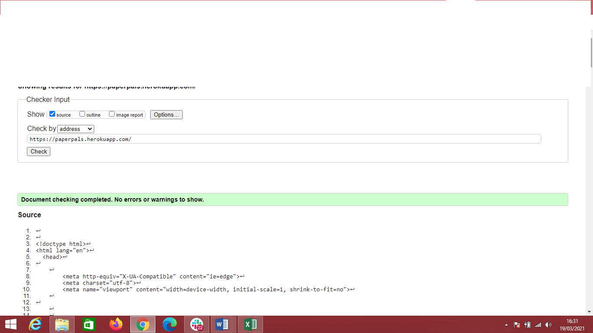
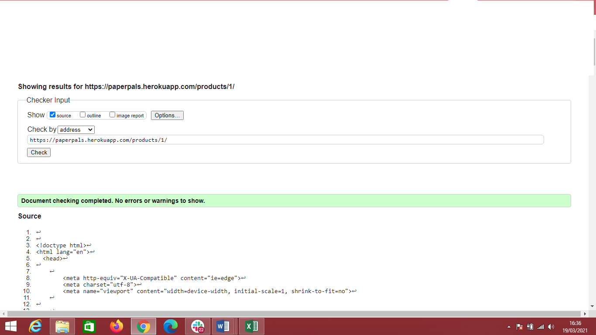
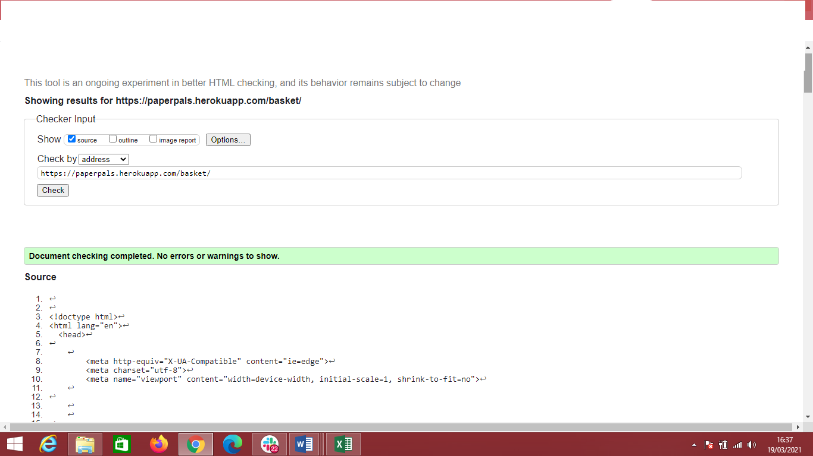
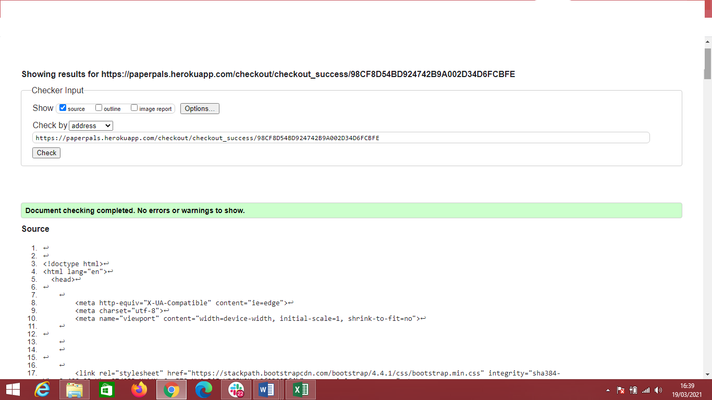
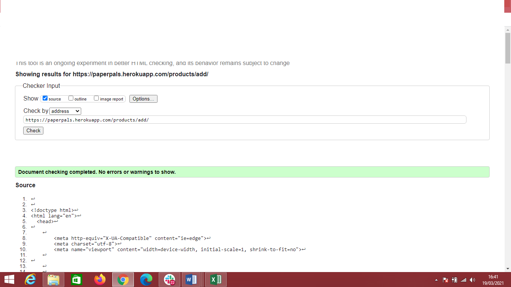
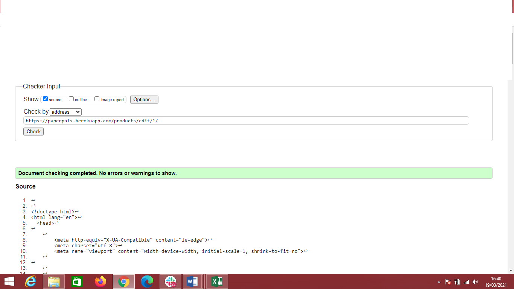
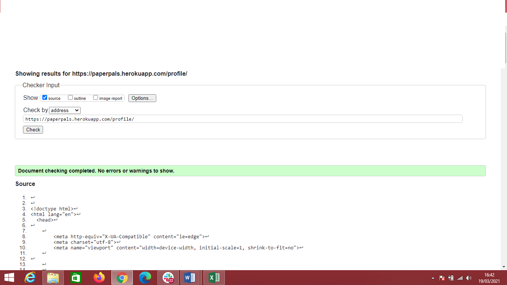
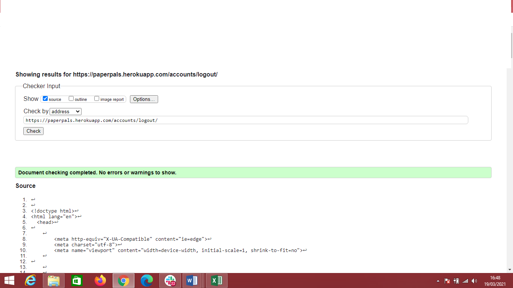
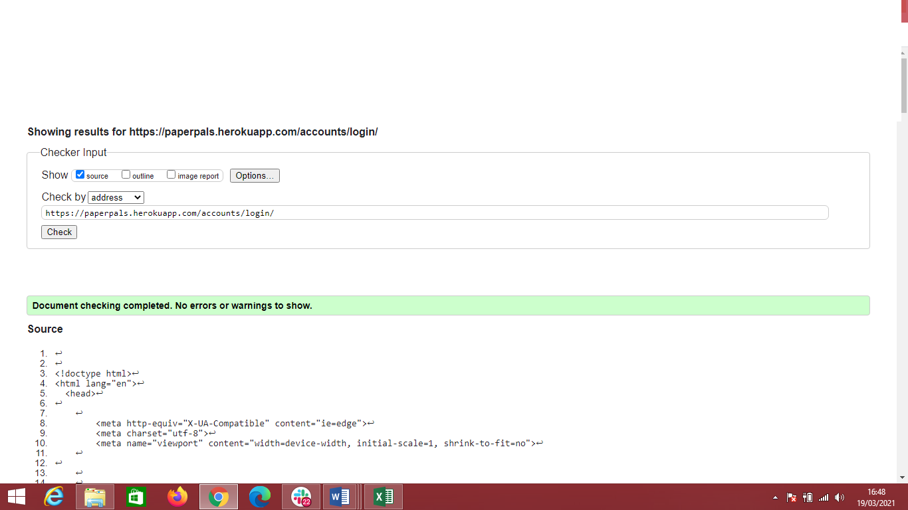

Testing details

### [README.md](README.md)
### [PaperPals](https://paperpals.herokuapp.com/)
## Table of Contents
1. [User Stories Testing](#user-stories-testing)
2. [Manual Testing](#manual-testing)
3. [Code Validation](#code-validation)
4. [Bugs Discovered](#bugs-discovered)
5. [Further Testing](#further-testing)

## User Stories Testing
The following section goes through the user stories identified in the UX section of README.md to check that the site meets those needs.
#### As a Shopper:
1. I want to view list of products.
    + Some of the products are visible on home page in the form of categories in link buttons, but once user clicks on All Products, all products are returned.
2. I want to view product details so that I can identify price, description, product rating and product image.
    + By clicking on product image, user is being redirected to product details where all details are shown.
    + User can also choose quantity of selected products.
3. I want to easily view total of my purchases at any time.
    + Once user adds product to basket, pop up message appears letting the user know of the action taken, showing mini summary of basket.
    + Also total amount of basket is displayed at all times under basket icon.
4. I want to sort the list of available products by best rated, price and category.
    + Once products are shown, users also have an option to filter by price and rating, both High-Low and Low-High.
5. I want to search for a product by name or description.
    + Search bar is located in middle of the navbar, always visible.
    + Searched word will show up once search button is clicked, or enter pressed. Searches are remembered in search bar as well for users to go back to when entering them in again.
6. I want to view items in my basket I am about to purchase or intend to purchase.
    + As products are added to basket, mini basket summary is shown in success message using toast.
    + Also by clicking on basket icon, user is directed to full basket view.
7. I want to adjust the quantity of individual items in my basket.
    + Quantity can easily be adjusted while being on basket page by clicking + or - and then clicking on update link.
    + Updated quantity will shown as it is expected.
8. I want to easily enter my payment information.
    + Short form is placed in checkout page, very few details taken from user, and also there is an option to save these details for the future, so the payment can proceed much faster.
9. I want to feel that my personal and payment information is safe and secure.
    + Stripe is being used to ensure all payment information is safe and secure.
10. I want to view an order confirmation after checkout.
    + Once payment is successful, order summary page is shown to user.
11. I want to receive an email confirmation after checking out.
    + While checking order summary above, user will receive an email also for future reference if necessary.
#### As a Site User:
1. I want to easily register/log in/ log out.
    + User icon is constantly shown in the navigation bar, so the user always has the option to sign in or out at any moment.
2. I want to easily recover my password in case I forget it.
    + On click of Forgot Password? on Sign In page, user can input their email address, email will be sent to them with a link to reset password.
3. I want to receive email confirmation after registering.
    + Once user inputs their email address and password, email will be sent to given email asking user to confirm their email.
4. I want to have a personalised user profile.
    + User can update their information by clicking on user icon.
    + Order history is shown also in case they require that information.
#### As a Shop Owner:
1. I want to add/edit/delete a product.
    + Only when Admin, or in this case owner is logged, Product Management option appears by clicking on user icon.
    + Owner can add products with only name, description and price being required fields.
    + Once product is added, owner is redirected to that product page.
    + Edit option appears then also on every product.
    + Once edit is done, owner/admin is redirected to edited product.
    + Delete option appears on every product.
    + There is no confirmation when delete is clicked, so owner/admin should be aware of it.
## Manual Testing
Below is a detailed account of all the manual testing that has been done to confirm all areas of the site work as expected.
#### Testing undertaken on desktop
All steps on desktop were repeated in browsers: Firefox, Chrome and Microsoft Edge and on two different desktop screen sizes.
##### Elements on every page
1. Navbar
    + Clicked each link in the navbar to confirm that it leads to the correct page.
    + Confirm that when logged out the options "Register" and "Login" are visible and that "My Profile" and "Logout" are not.
    + Log into the site, confirm that options "Account" and "Log out" are visible and that "Register" and "Log in" are not.
    + Log in as admin, confirm that "Product Managment" link was added.
    + Added something to basket and confirmed correct amount is showing under basket icon, also basket icon and amount is shown in bold text once there is item in basket.
    + Removed item from basket to confirm that basket icon and amount is back to normal. 
    + Clicked on PaperPals spherical logo and PaperPals header name to confirm page is brought page to home page.
    + Searched any word to confirm search bar is showing correct results.
2. Footer
    + Clicked on location, to make sure it connects with google maps and actual shop location.
    + Clicked on email address provided to confirm default mail service will start up with correct subject and email address.
    + Clicked on PaperPals spherical logo and PaperPals logo name to confirm page is brought page to home page in both Nav bar and footer.
    + Clicked on social links to confirm it opens correct user social accounts.
##### Home
1. Home Carousel
    + Waited couple of seconds to confirm images will change, after that clicked on slider icons, they work as expected.
2. Categories
    + Hover over categories to confirm zoom in effect is shown.
    + Clicked on each category and confirmed that correct category and products are shown.
##### Products
1. Category links
    + Click on each category, confirm that correct category is shown.
2. Sort
    + Sorted by Name and Ratings, confirm that both High-Low and Low-High are displaying correctly.
3. Product count
    + Confirmed that correct product count is shown.
4. Product details
    + Click each product to confirm product details page is shown.
    + Clicked on quantity, confirm everything works as expected.
    + Clicked on Keep Shopping button, confirm that redirects to products page.
    + Clicked on Add to basket button, item was added to basket.
    + When product was added, success message appeared with mini basket summary window popped up.
    + Clicked to Secure Checkout in the pop up message, was successfully redirected to basket page.
##### Basket
1. Basket summary
    + Confirm that correct product details(image, description, quantity and price) are shown.
    + Confirm that quantity selector works as expected.
    + Delete link removes item from basket as expected.
    + Basket total is shown correctly.
2. Keep Shopping
    + By clicking on Keep Shopping button I was redirected to products page, as expected.
3. Secure Checkout
    + By clicking on Secure Checkout button, I was redirected to checkout page, as expected.
##### Checkout
1. Order summary
    + Confirm that correct product details(image, description, quantity and price) are shown.
2. Details form
    + Confirm that form validation is working as expected.
    + Confirmed that "Save this delivery information to my profile" selector works as it should.
3. Payment 
    + Confirm that stripe card validation is working.
4. Adjust Basket
    + On click on this button, I was redirected to basket page, as expected.
5. Complete Order
    + Confirm that on click of the button, payment is submitted.
    + Loading spinner appeared as expected.
##### Order Summary
1. Order information
    + Confirm that order information is shown as expected.
    + Confirm that user basket session is deleted.
    + Confirmed that email was sent to customer with order summary included.
2. Checkout our deals button
    + By clicking on the button, I was redirected to products with category deals, no issues here.

##### Register

+ Confirm that the register form is displayed as expected.
+ Fill in the form with a username already in the database, confirm that the user is informed that they must use a unique username.
+ Fill in the email input with a non-email address, confirm the user is shown an error asking user to use an email address.
+ Fill in the form with two different passwords, confirm the error is caught again and the user is informed of their mistake.
+ Fill in the registration for correctly, confirm that the email is sent to user to confirm email address. Once user confirms email address, message success notification appears notifying user that email is confirmed now and page redirects to Sign In page.

##### Login

+ Attempt to log in with a username not in the database, confirm the relevant error message is shown.
+ Attempt to log in with a correct username but wrong password, confirm the relevant error message is shown.
+ Log in with a correct username and password, confirm that the user is logged in and that they are redirected home page.
+ Try to return to the login page url when already logged in, confirm that the user is redirected to the home page.

##### Logout

+ Click the "Logout" link in the navigation bar. By clicking on Sign Out, confirm that the user is logged out.
+ Confirm that clicking on Cancel user is redirected to home page.

##### My Profile

+ Confirm that profile page is displayed correctly.
+ Confirm that order history is shown as it should.
+ Confirm that users information is prepopulated if already filled in.
+ Clicked on Update Information button and confirmed that profile has been updated if so.
+ Message success also appears to notify user of the action taken.

##### SuperUser/Admin

+ Ensured superuser and admin cannot be accessed if users are not superuser or admin. If users find out the profile link, users are directed to a page to say they are not a super user and do not have access to this page. 

##### Message notifications

+ Added item to basket and confirmed that mini summary is shown in message success.
+ Deleted item to confirm the message success appears notifying user of action taken.
+ Edited item to confirm Alert message, works as expected.
+ Searched with no text inside search bar, confirmed Error message.

#### Testing undertaken on tablet and phone devices

All steps below were repeated to test mobile and tablet specific elements on my Samsung phone and Ipad, using Google Chrome, Mozilla Firefox, Opera and Safari.
Responsive design was also tested in the Chrome Developer Tools device simulators on all options and orientations.

##### Elements on every page

1. Navbar
    + Open the website on mobile, confirm that the navbar is collapsed into a burger icon
    + Click the burger icon, confirm that the navbar list appears as expected.
    + Add something to the basket, confirm that the user shopping basket icon appears as bold and price displays correctly.
2. Footer
    + Scroll to the bottom of the page, confirm that the footer contents is displayed as expected with the bootstrap grid.
    + No content squashed or squeezed or disproportionate in size.
    + Confirm that all links and buttons in footer are easy to click with a finger on the smallest screen sizes.

##### Products

+ Confirm that dropdown button with categories appears and works as expected no matter which category is selected.
+ Confirm that the product list is displayed one on top of each other on mobile, and 3 to a row on tablet.
+ Confirm that all clicks and swipes operate as expected on touch screen.

##### All pages

+ Navigate to all pages on the site, check that the layout is as expected for the screen size.
+ Check that all buttons, menus, forms and other elements are the correct proportions and easily clickable with a finger.

## Code Validation

### [Autoprefixer](https://autoprefixer.github.io/)
+ Added prefixes to CSS for different browsers.
### [CSS Validator](https://jigsaw.w3.org/css-validator/)
+ Couple of errors showed on base.css.

+ Errors appeared because I wanted to override default `ul` styling as shown on image.\

+ Also couple of warnings were shown but all of them were due to prefix vendors.
### [CSS Formatter](https://www.cleancss.com/css-beautify/)
+ Formatted base.css.
### [HTML Validator](https://validator.w3.org/nu/)
#### Home Page

+ No errors.
#### Products Page

+ No errors
#### Product Details Page

+ No errors.
#### Basket Page

+ No errors.
#### Checkout Page

+ No errors.

+ No errors.
#### Add/Edit Page


+ No errors.
#### Profile Page

+ No errors.
#### Sign Up/Login Page


+ No errors.
### [HTML Formatter](https://webformatter.com/html)
+ Formatted all HTML files for readability and industry standards.
### [JSHint](https://jshint.com/)
+ Couple of warnings for undefined variable ("$"), it was referring to JQuery selector and it can be ignored.
### [CSS Validator]( https://jigsaw.w3.org/css-validator/validator)
+ No errors found.
### [Flake8](https://flake8.pycqa.org/en/latest/)
+ Used flake8 to validate python files. Had multiple errors:
    + ```E501 line too long (92 > 79 characters)``` Reformatted my code as much as I could, still couple of them left.
    + ```F401 module imported but unused``` Deleted all not used imports.
    + ```W293 blank line contains whitespace``` Deleted all left out whitespace.
    + ```W292 no newline at end of file``` Added new line where it was necessary.
### [PEP8](http://pep8online.com/)
+ After Flake8, I've decided to double check my .py files in PEP8.
+ Everything seemed fine, apart from couple of warnings for ```E501 line too long (92 > 79 characters)```, but as mentioned above, code was reformatted as best I could.
## Bugs Discovered
#### Solved bugs
1. Images on certain items were not loading up in products.html. Items from image files would not load or show the no image available alternative. I checked spelling and it was correct. To rectify this I had to update and edit products image with an upload. This fixed the issue and has no issues since.
2. Products sizing of images. Sometimes the sizing of images on the mobile screen were not being targeted or affected. Fixed this with media query.
3. Github didnt catch up to my jeroku database and was not loaded up in the postgres. I have to manually comment out code in settings.py to revert back, Dump the products app and then add it back into it using media.json file. I then refigured the config vars in env.py an ensured they were all correct before adding and pushing back to github.
4. Email confirmation was not working. I had to realise that this was due to the teste being carried out in github and Gamil will not will with github I have tested on Heroku extensively and all emails come through on Heroku.


## Further testing:
+ Asked fellow students, friends and family to look at the site on their devices and report any issues they found.


